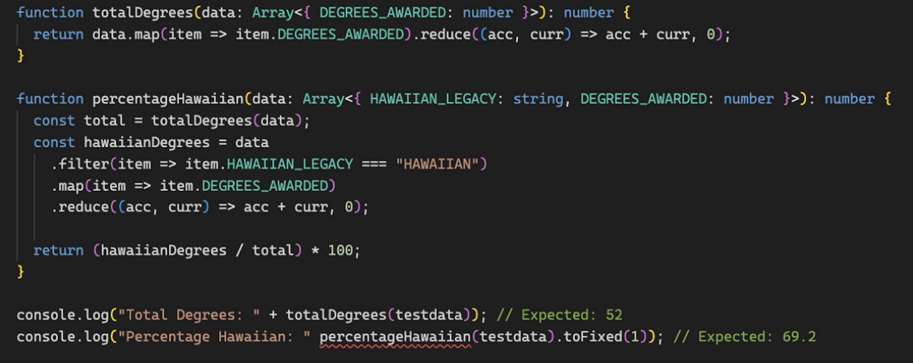

ICS 314 from UH Manoa was my introduction to functional programming, user interface frameworks, project management and software engineering as a whole.

##What is functional programming?

Functional programming is a programming paradigm that treats computation as the evaluation of mathematical functions, emphasizing immutability and avoiding changing state or mutable data. To simplify functional programming, functional programming uses functions and expressions to build programs.The idea behind it is to keep work simple and predictable, what you implement gives the same result every time, without changing anything else in the process. This class introduced me to the core concepts of functional programming such as higher-order functions and recursions, promoting a clean, predictable and testable code. 

A functional programming file may look as follows:

Using functional programming, functions break down your work and then are called for output or results. The understanding of functional programming has helped me to reshape how I think about solving problems. Instead of focusing on how tasks are done, I now consider what the output should be.

##What is User Interface Frameworks?

Simply user interface (UI) frameworks are the building blocks for creating websites and apps. Instead of starting from scratch, the frameworks give you a pre-made design and the tools to build user-friendly interfaces. A good analogy I have learned for the UI frameworks is to think of it like a lego set. Instead of having to start a set by molding the lego pieces, each lego set gives you a starting point, a lego kit and its design instructions. Frameworks help design all kinds of interactive technology, from the screen on the ATMs, apps on our phones, and even the car dashboards. UI frameworks create more efficient software engineers, ensuring everything looks and works smoothly, no matter the project.

Here is an example of how I used UI frameworks to recreate the Black Diamond website:

UI frameworks helped me to create a professional recreation of the Black Diamond website. It sped up the process, created consistency in my design, helped me to create a responsive layout (when changing window size or on a different device), ensured my work works well on any browser, and allowed me to simplify my customizable abilities.

##What is Project Management?

So what is project management and how do you manage a project effectively? Project management was something that was introduced in this class. Project management is all about organizing work so a team can create a project more efficiently. In this course, we learned about using certain approaches.

One approach and concept is breaking down a project into milestones and tasks. Milestones help to create manageable goals for the reach of a project and tasks make sure that the team knows what's needed to complete that milestone. It also helps to make sure each team member is contributing to the project and has a role. For example, In my final project with a team of five, we had three milestones, each had a project role, and each had assigned tasks for each milestone. While managing a project as a team, something we found very important is collaboration. Being able to have a remote way to communicate such as messages, web meetings or calls helped to manage our project. Another crucial part of project management was making sure we had a start of week and end of week in person check in to be able to have a space where we were able to collaborate together.

Managing the project itself with many team members was a hard concept to understand at first, what you can use in this case is something like Github. Github is a platform that allows developers to store, share and collaborate on code, it also is an open-source version control system meaning it allows multiple people to make changes at once.

Here is an example of my team’s Github page where we were able to assign and manage tasks:

This class and the introduction to software engineering and team management was very important to me and my future career. I definitely see myself expanding on these skills in my upcoming class and using them as a resource for my further work.

